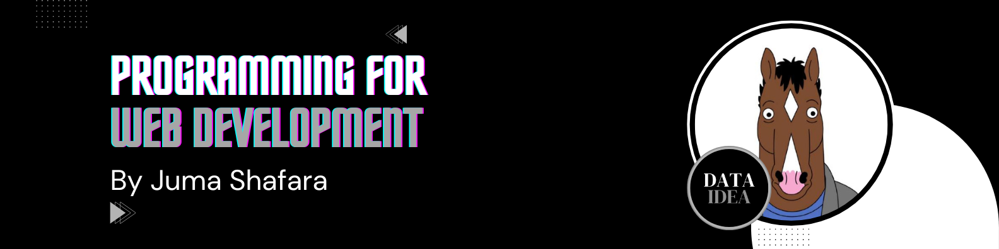

# Blog Project: JavaScript Interactivity

In this tutorial, we'll add JavaScript to enhance user experience with smooth animations, form validation, and interactive features.

## Step 1: Create Main JavaScript File

Create `static/js/main.js`:

```javascript
// ========================================
// DOM Content Loaded
// ========================================
document.addEventListener('DOMContentLoaded', function() {
    initSmoothScroll();
    initFormValidation();
    initSearchEnhancement();
    initCommentForm();
    initMobileMenu();
    initScrollToTop();
});

// ========================================
// Smooth Scrolling
// ========================================
function initSmoothScroll() {
    document.querySelectorAll('a[href^="#"]').forEach(anchor => {
        anchor.addEventListener('click', function(e) {
            e.preventDefault();
            const target = document.querySelector(this.getAttribute('href'));
            if (target) {
                target.scrollIntoView({
                    behavior: 'smooth',
                    block: 'start'
                });
            }
        });
    });
}

// ========================================
// Form Validation
// ========================================
function initFormValidation() {
    const forms = document.querySelectorAll('form');
    
    forms.forEach(form => {
        form.addEventListener('submit', function(e) {
            if (!validateForm(this)) {
                e.preventDefault();
                showFormErrors(this);
            }
        });
    });
}

function validateForm(form) {
    let isValid = true;
    const requiredFields = form.querySelectorAll('[required]');
    
    requiredFields.forEach(field => {
        if (!field.value.trim()) {
            isValid = false;
            field.classList.add('error');
        } else {
            field.classList.remove('error');
        }
    });
    
    // Email validation
    const emailFields = form.querySelectorAll('input[type="email"]');
    emailFields.forEach(field => {
        const emailRegex = /^[^\s@]+@[^\s@]+\.[^\s@]+$/;
        if (field.value && !emailRegex.test(field.value)) {
            isValid = false;
            field.classList.add('error');
        }
    });
    
    return isValid;
}

function showFormErrors(form) {
    const errorFields = form.querySelectorAll('.error');
    if (errorFields.length > 0) {
        const firstError = errorFields[0];
        firstError.focus();
        firstError.scrollIntoView({ behavior: 'smooth', block: 'center' });
    }
}

// ========================================
// Search Enhancement
// ========================================
function initSearchEnhancement() {
    const searchInput = document.querySelector('.search-input');
    const searchForm = document.querySelector('.search-form');
    
    if (searchInput && searchForm) {
        // Add search suggestions (optional)
        searchInput.addEventListener('input', function() {
            const query = this.value.trim();
            if (query.length > 2) {
                // Could add autocomplete here
                highlightSearchTerm(query);
            }
        });
        
        // Prevent empty search
        searchForm.addEventListener('submit', function(e) {
            const query = searchInput.value.trim();
            if (!query) {
                e.preventDefault();
                searchInput.focus();
                showNotification('Please enter a search term', 'warning');
            }
        });
    }
}

function highlightSearchTerm(term) {
    // Highlight search terms in results (if on search page)
    const results = document.querySelectorAll('.post-card');
    results.forEach(card => {
        const text = card.textContent;
        // Simple highlighting logic
    });
}

// ========================================
// Comment Form Enhancement
// ========================================
function initCommentForm() {
    const commentForm = document.querySelector('.comment-form');
    
    if (commentForm) {
        // Character counter for comment
        const contentField = commentForm.querySelector('textarea[name="content"]');
        if (contentField) {
            const counter = document.createElement('div');
            counter.className = 'char-counter';
            counter.textContent = '0 characters';
            contentField.parentNode.appendChild(counter);
            
            contentField.addEventListener('input', function() {
                const length = this.value.length;
                counter.textContent = `${length} characters`;
                
                if (length > 1000) {
                    counter.classList.add('warning');
                } else {
                    counter.classList.remove('warning');
                }
            });
        }
        
        // Auto-resize textarea
        if (contentField) {
            contentField.addEventListener('input', function() {
                this.style.height = 'auto';
                this.style.height = this.scrollHeight + 'px';
            });
        }
    }
}

// ========================================
// Mobile Menu Toggle
// ========================================
function initMobileMenu() {
    const navMenu = document.querySelector('.nav-menu');
    const menuToggle = document.createElement('button');
    menuToggle.className = 'menu-toggle';
    menuToggle.innerHTML = '☰';
    menuToggle.setAttribute('aria-label', 'Toggle menu');
    
    const navbar = document.querySelector('.navbar .container');
    if (navbar && window.innerWidth <= 768) {
        navbar.insertBefore(menuToggle, navMenu);
        
        menuToggle.addEventListener('click', function() {
            navMenu.classList.toggle('active');
            this.innerHTML = navMenu.classList.contains('active') ? '✕' : '☰';
        });
    }
}

// ========================================
// Scroll to Top Button
// ========================================
function initScrollToTop() {
    // Create scroll to top button
    const scrollBtn = document.createElement('button');
    scrollBtn.className = 'scroll-to-top';
    scrollBtn.innerHTML = '↑';
    scrollBtn.setAttribute('aria-label', 'Scroll to top');
    document.body.appendChild(scrollBtn);
    
    // Show/hide button based on scroll position
    window.addEventListener('scroll', function() {
        if (window.pageYOffset > 300) {
            scrollBtn.classList.add('visible');
        } else {
            scrollBtn.classList.remove('visible');
        }
    });
    
    // Scroll to top on click
    scrollBtn.addEventListener('click', function() {
        window.scrollTo({
            top: 0,
            behavior: 'smooth'
        });
    });
}

// ========================================
// Notification System
// ========================================
function showNotification(message, type = 'info') {
    const notification = document.createElement('div');
    notification.className = `notification notification-${type}`;
    notification.textContent = message;
    
    document.body.appendChild(notification);
    
    // Show notification
    setTimeout(() => {
        notification.classList.add('show');
    }, 100);
    
    // Hide and remove after 3 seconds
    setTimeout(() => {
        notification.classList.remove('show');
        setTimeout(() => {
            notification.remove();
        }, 300);
    }, 3000);
}

// ========================================
// Lazy Loading Images
// ========================================
function initLazyLoading() {
    const images = document.querySelectorAll('img[data-src]');
    
    const imageObserver = new IntersectionObserver((entries, observer) => {
        entries.forEach(entry => {
            if (entry.isIntersecting) {
                const img = entry.target;
                img.src = img.dataset.src;
                img.removeAttribute('data-src');
                observer.unobserve(img);
            }
        });
    });
    
    images.forEach(img => imageObserver.observe(img));
}

// ========================================
// Reading Progress Bar
// ========================================
function initReadingProgress() {
    const progressBar = document.createElement('div');
    progressBar.className = 'reading-progress';
    document.body.appendChild(progressBar);
    
    window.addEventListener('scroll', function() {
        const windowHeight = window.innerHeight;
        const documentHeight = document.documentElement.scrollHeight;
        const scrollTop = window.pageYOffset;
        const progress = (scrollTop / (documentHeight - windowHeight)) * 100;
        
        progressBar.style.width = `${progress}%`;
    });
}
```

## Step 2: Add JavaScript Styles

Add these styles to `static/css/style.css`:

```css
/* ========================================
   JavaScript-Enhanced Styles
   ======================================== */

/* Form Errors */
.form-control.error {
    border-color: #ef4444;
    box-shadow: 0 0 0 3px rgba(239, 68, 68, 0.1);
}

/* Character Counter */
.char-counter {
    font-size: 0.875rem;
    color: var(--text-light);
    margin-top: 0.5rem;
}

.char-counter.warning {
    color: #f59e0b;
}

/* Mobile Menu Toggle */
.menu-toggle {
    display: none;
    background: none;
    border: none;
    font-size: 1.5rem;
    cursor: pointer;
    color: var(--text-color);
}

@media (max-width: 768px) {
    .menu-toggle {
        display: block;
    }
    
    .nav-menu {
        display: none;
        width: 100%;
        flex-direction: column;
    }
    
    .nav-menu.active {
        display: flex;
    }
}

/* Scroll to Top Button */
.scroll-to-top {
    position: fixed;
    bottom: 2rem;
    right: 2rem;
    width: 50px;
    height: 50px;
    background: var(--primary-color);
    color: white;
    border: none;
    border-radius: 50%;
    font-size: 1.5rem;
    cursor: pointer;
    opacity: 0;
    visibility: hidden;
    transition: var(--transition);
    z-index: 1000;
}

.scroll-to-top.visible {
    opacity: 1;
    visibility: visible;
}

.scroll-to-top:hover {
    transform: translateY(-3px);
    box-shadow: var(--shadow-lg);
}

/* Reading Progress Bar */
.reading-progress {
    position: fixed;
    top: 0;
    left: 0;
    height: 3px;
    background: var(--primary-color);
    z-index: 9999;
    transition: width 0.1s ease;
}

/* Notifications */
.notification {
    position: fixed;
    top: 2rem;
    right: 2rem;
    padding: 1rem 1.5rem;
    background: white;
    border-radius: var(--radius);
    box-shadow: var(--shadow-lg);
    opacity: 0;
    transform: translateX(400px);
    transition: var(--transition);
    z-index: 10000;
}

.notification.show {
    opacity: 1;
    transform: translateX(0);
}

.notification-info {
    background: #3b82f6;
    color: white;
}

.notification-warning {
    background: #f59e0b;
    color: white;
}

.notification-success {
    background: #10b981;
    color: white;
}
```

## Step 3: Add Loading States

Enhance user experience with loading indicators:

```javascript
// Show loading state on form submission
function showLoading(form) {
    const submitBtn = form.querySelector('button[type="submit"]');
    if (submitBtn) {
        submitBtn.disabled = true;
        submitBtn.textContent = 'Submitting...';
    }
}

// Reset form after successful submission
function resetForm(form) {
    form.reset();
    const submitBtn = form.querySelector('button[type="submit"]');
    if (submitBtn) {
        submitBtn.disabled = false;
        submitBtn.textContent = 'Submit Comment';
    }
}
```

## JavaScript Best Practices

### Use Event Delegation

For dynamically added elements:

```javascript
document.addEventListener('click', function(e) {
    if (e.target.matches('.read-more')) {
        // Handle click
    }
});
```

### Debounce Search Input

Prevent too many API calls:

```javascript
function debounce(func, wait) {
    let timeout;
    return function executedFunction(...args) {
        const later = () => {
            clearTimeout(timeout);
            func(...args);
        };
        clearTimeout(timeout);
        timeout = setTimeout(later, wait);
    };
}

const debouncedSearch = debounce(handleSearch, 300);
```

### Error Handling

Always handle errors gracefully:

```javascript
try {
    // Your code
} catch (error) {
    console.error('Error:', error);
    showNotification('Something went wrong. Please try again.', 'error');
}
```

## What's Next?

Now that we have a fully functional blog with HTML, CSS, and JavaScript, we'll add user authentication so users can register and log in.

!!! success "JavaScript Added!"
    Your blog now has interactive features. In the next tutorial, we'll add user authentication.

---

**Previous Tutorial:** [CSS Styling](06_css_styling.md)  
**Next Tutorial:** [User Authentication](08_authentication.md)
